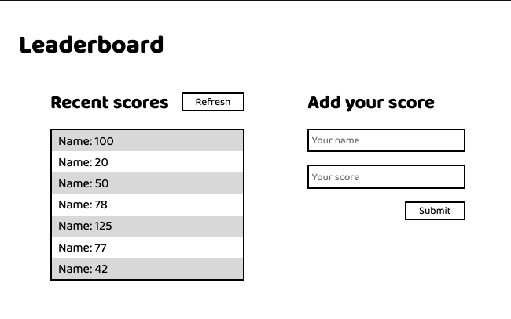

# JavaScript - Build with Webpack  [Todo List Exercise].

In this activity you will set up a JavaScript project for the Leaderboard list app, using webpack and ES6 features, notably modules. You should develop a first working version of the app following a wireframe, but without styling - just focus on functionality. [Find project specifications here](https://github.com/microverseinc/curriculum-javascript/blob/main/leaderboard/m1_basic_structure.md)
      

<div align="center">

[](https://github.com/errea/leader-board-project)
[](https://github.com/errea/leader-board-project/issues)
[](https://github.com/errea/leader-board-project/pull/1)

</div>

## 📝 Contents

<p align="center">
<a href="#with">Built with</a>&nbsp;&nbsp;&nbsp;|&nbsp;&nbsp;&nbsp;
<a href="#gs">Getting started</a>&nbsp;&nbsp;&nbsp;|&nbsp;&nbsp;&nbsp;
<a href="#author">Author</a>
</p>

># [Description]
>The leaderboard website displays scores submitted by different players. It also allows you to submit your score. Project 1: basic page structure.


## 🔧 Built with<a name = "with"></a>

- JavaScript
- DOM
- [Webpack config](hhttps://webpack.js.org/guides/getting-started/)
- ES6 Modules 
- [Gitflow](https://github.com/microverseinc/curriculum-transversal-skills/blob/main/git-github/articles/gitflow.md)


## Getting Started <a name = "gs"></a>
> To get a local copy up and running follow these simple example steps.

<details>
  <summary>Get instructions</summary>

```
$ cd <folder>
```

~~~bash
$ git clone https://github.com/errea/leader-board-project
$ cd leader-board-project
~~~

Run `npm Install` to install the node modules and webpacker.

Run `npm start` or `npm watch` opens on `http://localhost:8080/` in your browser.

Run `npm run build` to build the bundler.

## Set up
* Open your terminal and locate the folder you want to clone the repository and follow the steps above to install

</details>

## Project Structure

    WEBPACK-TODO_LIST
    ├── dist
    │   └── index.bundle.js
        └── index.html
    └── node_modules
    └── .github\workflows
        └── linters.yml
    └── src
        └── /img
      └── index.html
      └── index.js   
      └── style.css
    └── .eslintrc.json
    └── .gitignore
    └── .hintrc
    └──.stylelintrc.json
    └── MIT.md
    └── package-lock.json
    └── package.json
    └──README.md
    └── webpack.config.js

## ✒️  Authors <a name = "author"></a>

👤 **Eri**

- Github: [@errea](https://github.com/errea)
- Twitter: [@Erreakay](https://github.com/errea)
- Linkedin: [Eri Okereafor](https://www.linkedin.com/in/eri-ngozi-okereafor/)
  
## 🤝 Contributing

Contributions, issues and feature requests are welcome!

Feel free to check the [issues page](https://github.com/errea/leader-board-project/issues)
## 👍 Show your support

- Microverse: [@microverse](https://www.microverse.org/)

## Acknowledgments

- Microverse

## 📝 License

This project is [MIT](./MIT.md) licensed.

